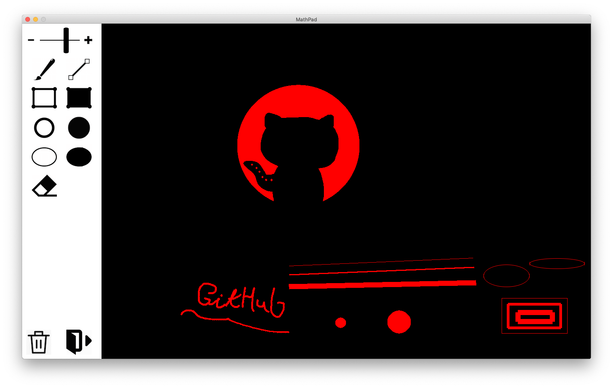

MathPad is a simple raster image creation app. It is an incredibly simple cross-platform alternative to the Microsoft Paint. Best used with a graphics tablet.

## Status

Simple single-color drawing is available. There is a circular brush tool, an "eraser" (brush of the background color), and simple geometric primitives.

### Features:
- Stroke width slider
- Circular brush
- Line tool
- Rectangle tool
- Filled rectangle tool
- Circle tool
- Filled circle tool
- Ellipse tool
- Filled ellipse tool
- Circular eraser
- Clear all tool

### Possible improvements:
- Replace [SDL2_gfx](http://www.ferzkopp.net/wordpress/2016/01/02/sdl_gfx-sdl2_gfx/) with a better implementation of geometric primitives
- Merge the ellipse and circle tools
- Add two modes to the ellipse and circle tools: a bounding box mode and a center + radius mode
- Add snapping
- Add grids
- Add rulers
- Add more tools
- Add a color selector
- Add the ability to export and import images
- Add layers
- Add undo-redo
- Add transparency support
- Add filters/shaders/other image manipulation functions
- etc. etc. ad nauseam
- Re-implement Adobe Photoshop and GIMP in any other capacity

### Known issues:
- Ellipse tool does not take stroke width into account due to a shortcoming of SDL2_gfx
- Flat ellipses are drawn wrongly on the ends of the major axis due to a bug in SDL2_gfx
- Filled ellipse tool only draws circles due to a bug in SDL2_gfx

## Building
MathPad uses [Shake](https://shakebuild.com/). Its sole dependency is [SLY](https://github.com/maximsmol/sly). In addition to the system-defined lib and include paths, the build system looks for the SLY shared library in `./dep/lib`, and for the SLY header file (`./src/lib/SLY.hpp`) in `./dep/include`.

After installing the dependencies, simply run `./build.sh` from the project folder.

## Manual
Use `./run.sh` to run the application.
